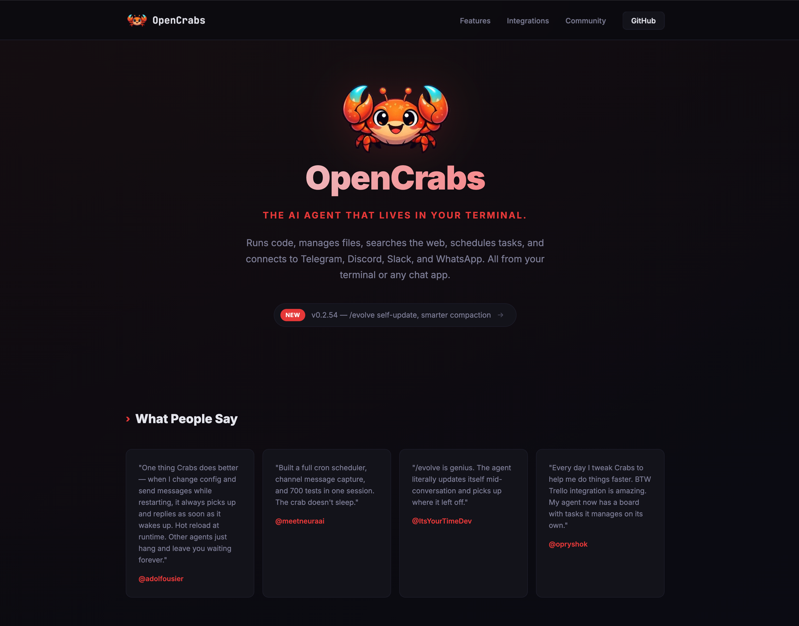

# Crabsland

Landing page for [OpenCrabs](https://github.com/adolfousier/opencrabs) — the AI agent that lives in your terminal.

Built with [Leptos](https://leptos.dev/) (Rust) and served via [Trunk](https://trunkrs.dev/).

## Prerequisites

- Rust (1.85+ for edition 2024)
- WASM target: `rustup target add wasm32-unknown-unknown`
- Trunk: `cargo install trunk`

## Development

```bash
trunk serve --open
```

This starts a local dev server with hot reload at `http://127.0.0.1:8080`.

## Build

```bash
trunk build --release
```

Output goes to the `dist/` directory.

## Documentation Site

The `docs/` directory contains an [mdBook](https://rust-lang.github.io/mdBook/) documentation site served at [docs.opencrabs.com](https://docs.opencrabs.com).

```bash
# Preview locally with live reload
cd docs && mdbook serve
# Opens at http://localhost:3000

# Or just build
cd docs && mdbook build
# Open docs/book/index.html in your browser
```

Install mdBook: `cargo install mdbook`

## Stack

- **Leptos 0.8** — Rust reactive UI framework (CSR mode)
- **Trunk** — WASM build tool and dev server
- **CSS** — Custom styles, no framework dependencies

## Screenshot



## License

MIT
